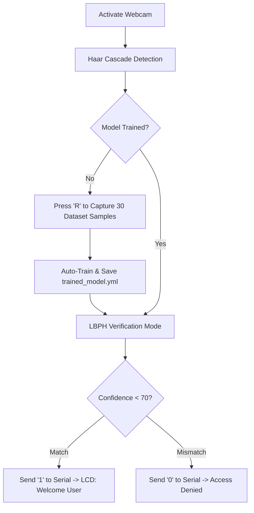

# 🏷️ Facial Recognition Attendance Tracker

<p align="center">
  
  
  
  
</p>

---

## 📝 Product Description
An AI-powered automated attendance system that replaces manual logbooks with real-time biometric verification. Running a high-speed **Face Detection and Recognition pipeline** (Haar Cascades + LBPH), the system identifies registered individuals via a webcam and instantly transmits authorization payloads to an Arduino hardware layer to manage localized access or displays.

---

## 👥 Team & Technical Roles

| Name | Professional Role | Core Engineering Responsibilities |
| :--- | :--- | :--- |
| **Joshua Nathanael Tampubolon** | **Core AI & Systems Architect** | • Engineered the backend computer vision pipeline utilizing OpenCV.<br>• Integrated the Local Binary Patterns Histograms (LBPH) mathematical model.<br>• Developed the primary system engine and OS-specific compilation drivers. |
| **Aditya Saputra Pambudi** | **Lead UI/UX & Graphics Engineer** | • Architected the runtime visual overlay and interactive state machine.<br>• Programmed the dynamic bounding box alert matrices (Green/Yellow/Red status states).<br>• Managed frame asset scaling, real-time telemetry rendering, and interface layouts. |
| **M Ikhsan Ar Rahman** | **Embedded Systems & Firmware Engineer** | • Authored the Arduino micro-controller firmware to parse inbound serial data packets.<br>• Managed memory addresses and data pipelines for the I2C 16x2 LCD layout engine.<br>• Engineered hardware wire topologies, debouncing logic, and electrical schematics. |
| **Fadil Hibrian Pratama** | **QA Engineer & Optimization Analyst** | • Executed automated benchmarking suites to evaluate frame-per-second latency drop.<br>• Fine-tuned the face-confidence threshold hyperparameters to eliminate false positives.<br>• Conducted security penetration testing (e.g., photo-spoofing tests) and edge-case validation. |

---

## 📂 Project Structure

```text
AttendanceProject/
├── 📄 SerialComm.h        # Serial interface definitions
├── 📄 SerialComm.cpp      # Cross-platform serial drivers (Windows/macOS)
├── 📄 FaceTracker.h       # LBPH Tracking engine definitions
├── 📄 FaceTracker.cpp     # Detection, registration, and training logic
├── 📄 main.cpp            # Application lifecycle entryway
└── ⚙️ haarcascade_frontalface_default.xml
```

---

## 💻 Source Code Components

### 1. `SerialComm.h`
```cpp
#ifndef SERIAL_COMM_H
#define SERIAL_COMM_H

#include <string>

void sendToArduino(const std::string& portName, const std::string& data);

#endif
```

### 2. `SerialComm.cpp` *(Cross-Platform: Windows & macOS)*
```cpp
#include "SerialComm.h"
#ifdef _WIN32
#include <windows.h>
#else
#include <unistd.h>
#include <fcntl.h>
#include <termios.h>
#endif

void sendToArduino(const std::string& portName, const std::string& data) {
#ifdef _WIN32
    HANDLE hSerial = CreateFileA(portName.c_str(), GENERIC_WRITE, 0, 0, OPEN_EXISTING, FILE_ATTRIBUTE_NORMAL, 0);
    if (hSerial != INVALID_HANDLE_VALUE) {
        DCB dcbSerialParams = {0};
        dcbSerialParams.DCBlength = sizeof(dcbSerialParams);
        if (GetCommState(hSerial, &dcbSerialParams)) {
            dcbSerialParams.BaudRate = CBR_9600;
            dcbSerialParams.ByteSize = 8;
            dcbSerialParams.StopBits = ONESTOPBIT;
            dcbSerialParams.Parity = NOPARITY;
            SetCommState(hSerial, &dcbSerialParams);
            
            DWORD bytes_written;
            WriteFile(hSerial, data.c_str(), data.length(), &bytes_written, NULL);
        }
        CloseHandle(hSerial);
    }
#else
    int fd = open(portName.c_str(), O_WRONLY | O_NOCTTY);
    if (fd != -1) {
        struct termios tty;
        tcgetattr(fd, &tty);
        cfsetospeed(&tty, B9600);
        tty.c_cflag = (tty.c_cflag & ~CSIZE) | CS8;
        tty.c_cflag &= ~PARENB;
        tty.c_cflag &= ~CSTOPB;
        tcsetattr(fd, TCSANOW, &tty);
        
        write(fd, data.c_str(), data.length());
        close(fd);
    }
#endif
}
```

### 3. `FaceTracker.h`
```cpp
#ifndef FACE_TRACKER_H
#define FACE_TRACKER_H

#include <opencv2/opencv.hpp>
#include <opencv2/face.hpp>
#include <vector>
#include <string>

class FaceTracker {
public:
    FaceTracker();
    bool init(const std::string& cascadePath);
    void startRegistration();
    void process(cv::Mat& frame, char key, const std::string& arduinoPort);

private:
    cv::CascadeClassifier face_cascade;
    cv::Ptr<cv::face::LBPHFaceRecognizer> recognizer;
    bool isTrained;
    std::vector<cv::Mat> trainingImages;
    std::vector<int> trainingLabels;
    int sampleCount;
    const int totalSamplesNeeded = 30;
    std::string lastRecognized;
    bool registrationRequested;
};

#endif
```

### 4. `FaceTracker.cpp`
```cpp
#include "FaceTracker.h"
#include "SerialComm.h"
#include <iostream>

using namespace cv;
using namespace cv::face;
using namespace std;

FaceTracker::FaceTracker() : isTrained(false), sampleCount(0), lastRecognized(""), registrationRequested(false) {
    recognizer = LBPHFaceRecognizer::create();
}

bool FaceTracker::init(const string& cascadePath) {
    if (!face_cascade.load(cascadePath)) return false;
    try {
        recognizer->read("trained_model.yml");
        isTrained = true;
    } catch (...) {
        cout << "No model found. Register face first." << endl;
    }
    return true;
}

void FaceTracker::startRegistration() {
    if (!isTrained) {
        sampleCount = 0;
        trainingImages.clear();
        trainingLabels.clear();
        registrationRequested = true;
        cout << "Starting registration..." << endl;
    }
}

void FaceTracker::process(Mat& frame, char key, const string& arduinoPort) {
    Mat gray;
    cvtColor(frame, gray, COLOR_BGR2GRAY);
    equalizeHist(gray, gray);

    vector<Rect> faces;
    face_cascade.detectMultiScale(gray, faces, 1.1, 4, 0, Size(100, 100));

    if (key == 'r' || key == 'R') startRegistration();

    for (size_t i = 0; i < faces.size(); i++) {
        Mat faceROI = gray(faces[i]);
        resize(faceROI, faceROI, Size(200, 200));

        string displayText = "Scanning...";
        Scalar color = Scalar(255, 255, 0);

        if (!isTrained && registrationRequested && sampleCount < totalSamplesNeeded) {
            trainingImages.push_back(faceROI.clone());
            trainingLabels.push_back(1);
            sampleCount++;
            
            displayText = "Registering: " + to_string(sampleCount) + "/" + to_string(totalSamplesNeeded);
            color = Scalar(0, 165, 255);

            if (sampleCount == totalSamplesNeeded) {
                recognizer->train(trainingImages, trainingLabels);
                recognizer->save("trained_model.yml");
                isTrained = true;
                registrationRequested = false;
                cout << "Face saved!" << endl;
            }
        } 
        else if (isTrained) {
            int label = -1;
            double confidence = 0.0;
            recognizer->predict(faceROI, label, confidence);

            if (label == 1 && confidence < 70.0) {
                displayText = "User " + to_string(label) + " - Present";
                color = Scalar(0, 255, 0);
                if (lastRecognized != displayText) {
                    sendToArduino(arduinoPort, "1\n");
                    lastRecognized = displayText;
                }
            } else {
                displayText = "Unknown Face";
                color = Scalar(0, 0, 255);
                if (lastRecognized != displayText) {
                    sendToArduino(arduinoPort, "0\n");
                    lastRecognized = displayText;
                }
            }
        }

        rectangle(frame, faces[i], color, 2);
        putText(frame, displayText, Point(faces[i].x, faces[i].y - 10), FONT_HERSHEY_SIMPLEX, 0.8, color, 2);
    }
}
```

### 5. `main.cpp`
```cpp
#include "FaceTracker.h"
#include <iostream>

using namespace cv;
using namespace std;

int main() {
    VideoCapture cap(0);
    if (!cap.isOpened()) {
        cerr << "Error: Cannot open webcam." << endl;
        return -1;
    }

    FaceTracker tracker;
    if (!tracker.init("haarcascade_frontalface_default.xml")) {
        cerr << "Error: Cannot load XML cascade file." << endl;
        return -1;
    }

    // Set hardware COM port here (e.g., "\\\\.\\COM3" for Windows or "/dev/cu.usbmodem101" for Mac)
    string arduinoPort = "/dev/cu.usbmodem101"; 
    Mat frame;

    cout << "Press 'R' to start face registration. Press 'ESC' to exit." << endl;

    while (true) {
        cap >> frame;
        if (frame.empty()) break;

        char key = (char)waitKey(10);
        if (key == 27) break;

        tracker.process(frame, key, arduinoPort);
        imshow("Facial Recognition Attendance Simulation", frame);
    }

    cap.release();
    destroyAllWindows();
    return 0;
}
```

---

## 💻 OS-Specific Prerequisites & Compilation

### 🍏 For macOS Users

#### 1. System Setup
Install OpenCV and compiler utilities via Homebrew:
```bash
brew install opencv pkg-config
```

#### 2. Hardware Configuration
Open `main.cpp` and set the connection string to match your Mac serial address:
```cpp
string arduinoPort = "/dev/cu.usbmodem101"; // Check your Arduino IDE Port menu
```

#### 3. Compilation & Execution
```bash
g++ -std=c++11 main.cpp SerialComm.cpp FaceTracker.cpp -o attendance `pkg-config --cflags --libs opencv4`
./attendance
```

---

### 🪟 For Windows Users

#### 1. System Setup
1. Download and extract **OpenCV for Windows** to `C:\opencv`.
2. Add `C:\opencv\build\x64\vc16\bin` to your system Environment **Path**.
3. Ensure a C++ compiler like MinGW (via MSYS2) is installed and added to environment variables.

#### 2. Hardware Configuration
Open `main.cpp` and change the string to follow the Win32 format:
```cpp
string arduinoPort = "\\\\.\\COM3"; // Match your actual Arduino COM port
```

#### 3. Compilation & Execution
```bash
g++ -std=c++11 main.cpp SerialComm.cpp FaceTracker.cpp -o attendance.exe -I"C:\opencv\build\include" -L"C:\opencv\build\x64\vc16\lib" -lopencv_world4xx
.\attendance.exe
```
*(Note: Replace `4xx` with your exact OpenCV release version number, e.g., `460` or `4100`)*

---

## 🚀 Step-by-Step Operational Tutorial

### 1️⃣ Step 1: System Boot & Initialization
* Run the executable via your terminal (`./attendance` or `.\attendance.exe`).
* The system checks your directory for an existing model database (`trained_model.yml`).
* If no model is found, the console prints: `No model found. Register face first.`
* The webcam interface initializes immediately, showing a live video feed labeled **"Facial Recognition Attendance Simulation"**.

### 2️⃣ Step 2: Biometric Enrollment (Phase 2)
```text
State: UNREGISTERED 🟡
Visual Cue: Yellow Bounding Box Around Detected Face
Text Overlay: "Scanning..."
```
* Step directly into the center frame of the camera.
* Press the **`R`** key on your keyboard to trigger the automatic data acquisition engine.
* **Action Required:** Keep looking at the lens while slightly tilting/shifting your head to capture multiple angles.
* The UI overlay will instantly change to an active progress tracker showing: `Registering: X/30` as it collects 30 unique, normalized matrix profiles of your face.

### 3️⃣ Step 3: Automated Model Training (Phase 3)
* The moment the sample collection counter hits `30/30`, the scanning phase locks.
* The system automatically offloads the captured imagery matrices into the **LBPH Face Recognizer** training algorithm.
* The terminal logs: `Training model...` followed shortly by `Face saved!`.
* A local binary file named `trained_model.yml` is generated in your project folder. The system is now fully autonomous and retains this memory even if you close the app.

### 4️⃣ Step 4: Live Verification & Attendance Logging (Phase 4 & 5)
The engine automatically flips from enrollment mode into live verification matching:

#### 🟢 Case A: Successful Match (Authorized Presence)
* **Visual Identity:** When you step into the frame, the bounding box turns bright **Green**.
* **UI Display:** Text changes to `User 1 - Present`.
* **Hardware Payload:** The application sends a high data flag (`"1\n"`) through the serial pipeline to the Arduino.
* **Hardware Response:** The Arduino parses the instruction, lighting up the connected LCD 16x2 block with a personalized message: `Selamat datang User`.

#### 🔴 Case B: Unrecognized Face (Access Denied)
* **Visual Identity:** If an unknown person steps into the camera track, the bounding box turns sharp **Red**.
* **UI Display:** Text displays `Unknown Face`.
* **Hardware Payload:** The application pushes a low data flag (`"0\n"`) through the serial connection.
* **Hardware Response:** The Arduino denies entry/logging and clears or flags the display appropriately.

---

## 🔄 System Workflow



---

## ⌨️ Operation Shortcuts

* **`R` / `r`** — Initiate Face Registration Mode (Gathers 30 frames automatically)
* **`ESC`** — Terminate processes and close the application safely
```
