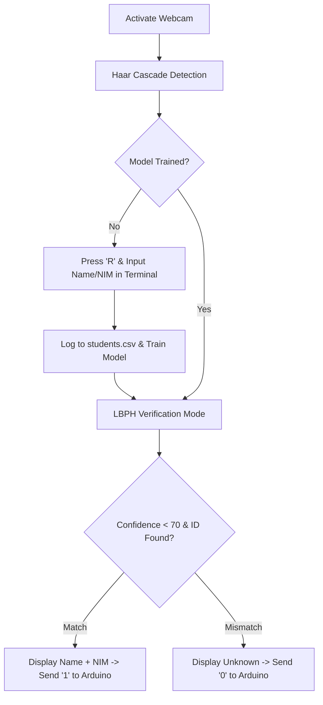

# 🏷️ Facial Recognition Attendance Tracker

<p align="center">
  
  
  
  
</p>

---

## 📝 Product Description
An AI-powered automated attendance system that replaces manual logbooks with real-time biometric verification. Running a high-speed **Face Detection and Recognition pipeline** (Haar Cascades + LBPH), the system identifies registered individuals via a webcam, maps them to a local CSV student profile database, and instantly transmits authorization payloads to an Arduino hardware layer.

---

## 👥 Team & Technical Roles

| Name | Professional Role | Core Engineering Responsibilities |
| :--- | :--- | :--- |
| **Joshua Nathanael Tampubolon** | **Core AI & Systems Architect** | • Engineered the backend computer vision pipeline utilizing OpenCV.<br>• Integrated the Local Binary Patterns Histograms (LBPH) mathematical model.<br>• Developed the primary system engine and OS-specific compilation drivers. |
| **Aditya Saputra Pambudi** | **Lead UI/UX & Graphics Engineer** | • Architected the runtime visual overlay and interactive state machine.<br>• Programmed the dynamic bounding box alert matrices (Green/Yellow/Red status states).<br>• Managed frame asset scaling, real-time telemetry rendering, and interface layouts. |
| **M Ikhsan Ar Rahman** | **Embedded Systems & Firmware Engineer** | • Authored the Arduino micro-controller firmware to parse inbound serial data packets.<br>• Managed memory addresses and data pipelines for the I2C 16x2 LCD layout engine.<br>• Engineered hardware wire topologies, debouncing logic, and electrical schematics. |
| **Fadil Hibrian Pratama** | **QA Engineer & Optimization Analyst** | • Executed automated benchmarking suites to evaluate frame-per-second latency drop.<br>• Fine-tuned the face-confidence threshold hyperparameters to eliminate false positives.<br>• Conducted security penetration testing (e.g., photo-spoofing tests) and edge-case validation. |

---

## 📂 Project Structure

```text
AttendanceProject/
├── 📄 SerialComm.h        # Serial interface definitions
├── 📄 SerialComm.cpp      # Cross-platform serial drivers (Windows/macOS)
├── 📄 FaceTracker.h       # LBPH Tracking engine definitions
├── 📄 FaceTracker.cpp     # Detection, registration, and CSV mapping database logic
├── 📄 main.cpp            # Application lifecycle entryway
├── 📄 students.csv        # Local student name and NIM metadata registry
└── ⚙️ haarcascade_frontalface_default.xml
```

---

## 💻 Source Code Components

### 1. `SerialComm.h`
```cpp
#ifndef SERIAL_COMM_H
#define SERIAL_COMM_H

#include <string>

void sendToArduino(const std::string& portName, const std::string& data);

#endif
```

### 2. `SerialComm.cpp`
```cpp
#include "SerialComm.h"
#ifdef _WIN32
#include <windows.h>
#else
#include <unistd.h>
#include <fcntl.h>
#include <termios.h>
#endif

void sendToArduino(const std::string& portName, const std::string& data) {
#ifdef _WIN32
    HANDLE hSerial = CreateFileA(portName.c_str(), GENERIC_WRITE, 0, 0, OPEN_EXISTING, FILE_ATTRIBUTE_NORMAL, 0);
    if (hSerial != INVALID_HANDLE_VALUE) {
        DCB dcbSerialParams = {0};
        dcbSerialParams.DCBlength = sizeof(dcbSerialParams);
        if (GetCommState(hSerial, &dcbSerialParams)) {
            dcbSerialParams.BaudRate = CBR_9600;
            dcbSerialParams.ByteSize = 8;
            dcbSerialParams.StopBits = ONESTOPBIT;
            dcbSerialParams.Parity = NOPARITY;
            SetCommState(hSerial, &dcbSerialParams);
            
            DWORD bytes_written;
            WriteFile(hSerial, data.c_str(), data.length(), &bytes_written, NULL);
        }
        CloseHandle(hSerial);
    }
#else
    int fd = open(portName.c_str(), O_WRONLY | O_NOCTTY);
    if (fd != -1) {
        struct termios tty;
        tcgetattr(fd, &tty);
        cfsetospeed(&tty, B9600);
        tty.c_cflag = (tty.c_cflag & ~CSIZE) | CS8;
        tty.c_cflag &= ~PARENB;
        tty.c_cflag &= ~CSTOPB;
        tcsetattr(fd, TCSANOW, &tty);
        
        write(fd, data.c_str(), data.length());
        close(fd);
    }
#endif
}
```

### 3. `FaceTracker.h`
```cpp
#ifndef FACE_TRACKER_H
#define FACE_TRACKER_H

#include <opencv2/opencv.hpp>
#include <opencv2/face.hpp>
#include <vector>
#include <string>
#include <map>

struct Student {
    std::string name;
    std::string nim;
};

class FaceTracker {
public:
    FaceTracker();
    bool init(const std::string& cascadePath);
    void startRegistration();
    void process(cv::Mat& frame, char key, const std::string& arduinoPort);

private:
    cv::CascadeClassifier face_cascade;
    cv::Ptr<cv::face::LBPHFaceRecognizer> recognizer;
    bool isTrained;
    std::vector<cv::Mat> trainingImages;
    std::vector<int> trainingLabels;
    int sampleCount;
    const int totalSamplesNeeded = 30;
    std::string lastRecognized;
    bool registrationRequested;

    // Database management
    std::map<int, Student> studentDatabase;
    int currentRegisteringId;
    void loadDatabase();
    void saveToDatabase(int id, const std::string& name, const std::string& nim);
};

#endif
```

### 4. `FaceTracker.cpp`
```cpp
#include "FaceTracker.h"
#include "SerialComm.h"
#include <iostream>
#include <fstream>
#include <sstream>

using namespace cv;
using namespace cv::face;
using namespace std;

FaceTracker::FaceTracker() : isTrained(false), sampleCount(0), lastRecognized(""), registrationRequested(false), currentRegisteringId(1) {
    recognizer = LBPHFaceRecognizer::create();
}

void FaceTracker::loadDatabase() {
    studentDatabase.clear();
    ifstream file("students.csv");
    if (!file.is_open()) return;

    string line;
    int maxId = 0;
    while (getline(file, line)) {
        stringstream ss(line);
        string idStr, name, nim;
        if (getline(ss, idStr, ',') && getline(ss, name, ',') && getline(ss, nim, ',')) {
            int id = stoi(idStr);
            studentDatabase[id] = {name, nim};
            if (id > maxId) maxId = id;
        }
    }
    file.close();
    currentRegisteringId = maxId + 1;
}

void FaceTracker::saveToDatabase(int id, const string& name, const string& nim) {
    ofstream file("students.csv", ios::app);
    if (file.is_open()) {
        file << id << "," << name << "," << nim << "\n";
        file.close();
    }
    studentDatabase[id] = {name, nim};
}

bool FaceTracker::init(const string& cascadePath) {
    if (!face_cascade.load(cascadePath)) return false;
    loadDatabase();
    try {
        recognizer->read("trained_model.yml");
        isTrained = true;
    } catch (...) {
        cout << "No model found. Register face first." << endl;
    }
    return true;
}

void FaceTracker::startRegistration() {
    string name, nim;
    cout << "\n=== NEW STUDENT REGISTRATION ===" << endl;
    cout << "Enter Student Name: ";
    getline(cin, name);
    cout << "Enter Student NIM: ";
    getline(cin, nim);

    sampleCount = 0;
    trainingImages.clear();
    trainingLabels.clear();
    registrationRequested = true;
    
    saveToDatabase(currentRegisteringId, name, nim);
    cout << "Data saved to database. Look at the camera to capture face profile..." << endl;
}

void FaceTracker::process(Mat& frame, char key, const string& arduinoPort) {
    Mat gray;
    cvtColor(frame, gray, COLOR_BGR2GRAY);
    equalizeHist(gray, gray);

    vector<Rect> faces;
    face_cascade.detectMultiScale(gray, faces, 1.1, 4, 0, Size(100, 100));

    if (key == 'r' || key == 'R') {
        startRegistration();
        return; 
    }

    for (size_t i = 0; i < faces.size(); i++) {
        Mat faceROI = gray(faces[i]);
        resize(faceROI, faceROI, Size(200, 200));

        string displayText = "Scanning...";
        Scalar color = Scalar(255, 255, 0);

        if (registrationRequested && sampleCount < totalSamplesNeeded) {
            trainingImages.push_back(faceROI.clone());
            trainingLabels.push_back(currentRegisteringId);
            sampleCount++;
            
            displayText = "Registering: " + to_string(sampleCount) + "/" + to_string(totalSamplesNeeded);
            color = Scalar(0, 165, 255);

            if (sampleCount == totalSamplesNeeded) {
                try {
                    recognizer->read("trained_model.yml");
                    recognizer->update(trainingImages, trainingLabels);
                } catch(...) {
                    recognizer->train(trainingImages, trainingLabels);
                }
                
                recognizer->save("trained_model.yml");
                isTrained = true;
                registrationRequested = false;
                cout << "Face profile trained and locked successfully for ID: " << currentRegisteringId << "!\n" << endl;
                currentRegisteringId++; 
            }
        } 
        else if (isTrained && !registrationRequested) {
            int label = -1;
            double confidence = 0.0;
            recognizer->predict(faceROI, label, confidence);

            if (studentDatabase.find(label) != studentDatabase.end() && confidence < 70.0) {
                Student s = studentDatabase[label];
                displayText = s.name + " (" + s.nim + ") - Present";
                color = Scalar(0, 255, 0);
                
                if (lastRecognized != displayText) {
                    sendToArduino(arduinoPort, "1\n");
                    lastRecognized = displayText;
                }
            } else {
                displayText = "Unknown Face";
                color = Scalar(0, 0, 255);
                
                if (lastRecognized != displayText) {
                    sendToArduino(arduinoPort, "0\n");
                    lastRecognized = displayText;
                }
            }
        }

        rectangle(frame, faces[i], color, 2);
        putText(frame, displayText, Point(faces[i].x, faces[i].y - 10), FONT_HERSHEY_SIMPLEX, 0.6, color, 2);
    }
}
```

### 5. `main.cpp`
```cpp
#include "FaceTracker.h"
#include <iostream>

using namespace cv;
using namespace std;

int main() {
    VideoCapture cap(0);
    if (!cap.isOpened()) {
        cerr << "Error: Cannot open webcam." << endl;
        return -1;
    }

    FaceTracker tracker;
    if (!tracker.init("haarcascade_frontalface_default.xml")) {
        cerr << "Error: Cannot load XML cascade file." << endl;
        return -1;
    }

    string arduinoPort = "/dev/cu.usbmodem101"; 
    Mat frame;

    cout << "Press 'R' in the graphics window to register a new student profile. Press 'ESC' to close application." << endl;

    while (true) {
        cap >> frame;
        if (frame.empty()) break;

        char key = (char)waitKey(10);
        if (key == 27) break;

        tracker.process(frame, key, arduinoPort);
        imshow("Facial Recognition Attendance Simulation", frame);
    }

    cap.release();
    destroyAllWindows();
    return 0;
}
```

---

## 💻 OS-Specific Prerequisites & Compilation

### 🍏 For macOS Users
```bash
brew install opencv pkg-config
g++ -std=c++11 *.cpp -o attendance `pkg-config --cflags --libs opencv4`
./attendance
```

### 🪟 For Windows Users
```bash
g++ -std=c++11 *.cpp -o attendance.exe -I"C:\opencv\build\include" -L"C:\opencv\build\x64\vc16\lib" -lopencv_world4xx
.\attendance.exe
```

---

## 🚀 Step-by-Step Operational Tutorial

### 1️⃣ Step 1: System Boot & Initialization
* Run the executable. The program initializes the webcam and automatically loads `students.csv` mapping registries along with the trained weight architecture file (`trained_model.yml`).

### 2️⃣ Step 2: Biometric & Metadata Enrollment
* Press **`R`** on your keyboard inside the window screen.
* Move to the terminal window and input the student's **Name** and **NIM** details.
* Look directly back at the webcam lens to automatically acquire 30 unique structural facial frames.

### 3️⃣ Step 3: Persistence Database Logging
* The system automatically maps the face profile to the entry inside `students.csv` and compiles the computational nodes into `trained_model.yml`.

### 4️⃣ Step 4: Verification Loop
* **Authorized Entry:** Bounding box highlights **Green**, rendering the student's actual **Name** and **NIM** on screen, while dispatching high payload `1` to the serial hardware stack.
* **Unauthorized Entry:** Bounding box highlights **Red**, displaying `Unknown Face` text flags and dispatching a low authorization signal `0`.

---

## 🔄 System Workflow


